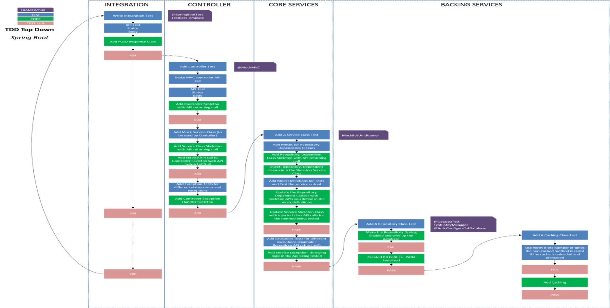

# springboot-tdd
TDD using Spring Boot

* This is a modified version of the project that is based on the Pivotal presentation https://www.youtube.com/watch?v=s9vt6UJiHg4 on TDD

* The application and tests have been built in stages of TDD 
* The tests are in a top down TDD approach. 
* Use the tags to view the gradual stages of TDD 
    * Add a Test
    * See Fail
    * Write Code
    * Run Tests
    * Refactor
    * Repeat
## TDD flow

